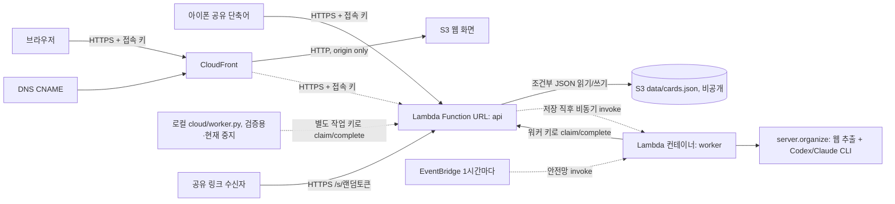

# 서랍(Link Shelf) — 아키텍처 및 설정 가이드

이 문서는 실제 AWS 계정 ID·S3 버킷명·Lambda 주소·도메인 같은 식별 정보를 담지 않습니다.
배포 시 아래 "환경 설정값"을 각자 계정에 맞게 정해서 `data/`(버전 관리 제외) 안에만 보관하세요.

## 목표

아이폰에서 링크·사진을 공유하면 카드(썸네일, 짧은 제목, 본문 기반 요약)로 정리합니다.
Route53·EC2·API Gateway 없이 **S3 + CloudFront(HTTPS) + Lambda Function URL + 서버리스 Lambda 워커(컨테이너 이미지)**로 운영합니다. 맥의 로컬 워커(`cloud/worker.py`)는 Lambda 워커 전환을 검증하는 데만 쓰고 지금은 중지된 상태입니다.

## 아키텍처



## 환경 설정값 (코드에 하드코딩하지 말 것)

| 항목 | 설명 | 보관 위치 |
|---|---|---|
| AWS 프로필 | `aws configure`로 만든 전용 프로필. **default 프로필 사용 금지** | 셸 환경, `--profile` 플래그 |
| AWS 리전 | 배포 리전(예: `<AWS_REGION>`) | 배포 명령의 `--region` 플래그 |
| S3 버킷명 | 웹·데이터를 함께 저장할 버킷 이름. 커스텀 도메인 CNAME과 버킷명이 같아야 S3 웹 엔드포인트 연결이 됨 | 최초 리소스 생성 시 로컬에서만 치환 (`cloud/INFRA.md` 참고) |
| 서비스 도메인 | 최종 접속 도메인(DNS CNAME 대상, CloudFront 배포 도메인으로 연결) | DNS 설정, `data/cloud-build/outputs.json` |
| CloudFormation 스택 이름 | 자유롭게 지정 | 배포 명령 인자 |
| 소유자 접속 키 | 앱 로그인용 비밀 키 | `data/token` (버전 관리 제외) |
| 워커 접속 키 | 로컬 워커(현재 중지, 검증용으로만 사용) 전용 키. Lambda 워커는 별도로 Secrets Manager에 자격증명 보관(`cloud/INFRA.md` 참고) | `data/cloud-worker-token`, `data/cloud-worker.json` (버전 관리 제외) |

`cloud/deploy.py`·`cloud/verify.py`에는 현재 운영 중인 버킷명/도메인이 예시로 박혀 있을 수 있습니다.
다른 계정에 새로 배포한다면 이 값들을 자신의 버킷명으로 바꿔서 사용하세요.

버킷 정책은 `index.html`/`config.js`/단축어 다운로드 파일만 익명 공개로 허용하고, `data/cards.json`과 `photos/*`는 비공개로 유지합니다.
DNS는 서비스 도메인을 CloudFront 배포 도메인으로 CNAME 연결합니다. CloudFront origin은 S3 웹사이트 엔드포인트(http-only, 버킷명에 점이 있어 REST 엔드포인트+HTTPS는 인증서 불일치로 동작 안 함)이며, 뷰어 쪽은 ACM 인증서로 HTTPS를 제공합니다. API/공유 링크는 별도로 Lambda Function URL의 HTTPS를 그대로 씁니다. 자세한 내용과 과거 장애 이력은 `cloud/INFRA.md` 참고.

## 코드 지도

| 파일 | 역할 |
|---|---|
| `static/index.html` | 단일 HTML/CSS/JS 화면. 폴더 hash 라우팅, 북마크·메모 카드, 삭제 복원, 공유 UI |
| `static/config.js` | 로컬 API 기본 설정. 온라인 배포에는 `data/cloud-build/config.js`로 덮어씀(버전 관리 제외) |
| `server.py` | 웹 본문 추출, AI 분류/요약(`organize`), 메모 AI 발췌(`extract_excerpt`). 로컬 SQLite 모드도 겸함 |
| `ai_runner.py` | Codex CLI 우선 호출, 사용량 한도 시 Claude Code로 1시간 쿨다운 후 대체 |
| `cloud/api.py` | Lambda 핸들러: 인증, S3 조건부 쓰기, 작업 lease, 공유 공개 HTML |
| `cloud/deploy.py` | `cloud/api.py`를 zip으로 묶어 api Lambda에 바로 배포(CloudFormation 미사용). 최초 리소스 생성은 `cloud/INFRA.md` 참고 |
| `cloud/worker_handler.py` | worker Lambda(컨테이너 이미지) 핸들러. 저장 직후 api가 비동기로 호출, 호출당 최대 20건 처리 후 종료 |
| `cloud/Dockerfile.worker` | worker Lambda 컨테이너 이미지 빌드 정의(Python 3.13 + Node + Codex/Claude Code CLI) |
| `cloud/worker.py` | 로컬(맥)에서 작업을 가져와 `organize`/`extract_excerpt` 실행 후 결과 반영. Lambda 워커 전환 검증에만 쓰고 지금은 중지 |
| `cloud/migrate.py` | 일회성 SQLite→S3 이전용. 운영 중 재실행 금지 |
| `cloud/verify.py`, `cloud/verify_features.py` | 배포 후 셀프 체크 스크립트 |
| `tests/` | 공유/메모/분류/AI 대체/AI 발췌 유닛 테스트 |
| `make_shortcut.py` | 서명 전 Apple 단축어(.shortcut) 템플릿 생성. 접속 키는 설치 시 사용자가 직접 입력(파일에 내장하지 않음) |
| `start.command`, `start-cloud.command` | caffeinate로 로컬 정리 워커 실행 |

## 데이터 모델

`data/cards.json` 구조: `{version:1, items:[...], memos:[...], shares:{digest:{item_id,created}}}`.

북마크 필드: `id`(URL SHA-256 앞 20자리), `url`, `title`, `summary`, `folder`, `tags`(JSON 문자열), `thumbnail`,
`status`, `source`, `note`, `created`, `error`, `revision`, `deleted`, 사진이면 `kind:'photo'`·`image_key`·`transcript`(사진 속 글자 OCR).
처리 중에는 `lease`/`lease_until`, 재시도는 `retry_at`이 추가됩니다.

메모 필드: `id`, `title`, `content`, `folder`, `bookmark_ids`, `created`, `updated`, `revision`.
AI 발췌 작업 중인 메모는 `kind:'memo-extract'`, `status`, `instruction`, `source_snapshot`, `source_memo_id`가 임시로 붙습니다.

쓰기는 최신 S3 ETag 조건부 PUT(`IfMatch`/`IfNoneMatch`)으로 처리하며, 충돌 시 최대 8회 재조회·재시도합니다.
상태 전이: `queued → processing → ready / needs_content / ai_waiting`. 작업 lease는 600초.

## API

| 메서드/경로 | 인증 | 동작 |
|---|---|---|
| GET `/api/items` | 소유자 키 | 삭제 제외 전체 북마크 |
| POST `/api/items` | 소유자 키 | `{url}` 또는 `{text,note}` 저장 |
| POST `/api/update` | 소유자 키 | `{id, folder/title}` 또는 `{id, note}`(재정리) |
| POST `/api/delete`, `/api/restore` | 소유자 키 | 소프트 삭제/복원 |
| POST `/api/photos` | 소유자 키 | JPEG base64 사진 저장 → 저장 직후 Lambda 워커가 자동 분류 |
| POST `/api/share`, `/api/unshare` | 소유자 키 | 공개 공유 링크 발급/종료 |
| GET `/s/<token>` | 링크 소지 | 읽기 전용 공개 HTML |
| GET `/api/memos` | 소유자 키 | 전체 메모 |
| POST `/api/memos/save`, `/api/memos/delete` | 소유자 키 | 메모 생성/수정/삭제(revision 충돌 검사) |
| POST `/api/memos/extract` | 소유자 키 | `{id, instruction}` — AI 발췌 작업을 큐에 등록 |
| POST `/worker/claim`, `/worker/complete` | 워커 키 | 대기 작업(북마크+메모 발췌) 임대/결과 반영 |

## 분류 규칙 요약 (`server.py`)

- 야구(MLB/KBO 포함)는 최상위 `야구`. 웃긴 예능/반응/밈은 소재보다 공유 목적으로 `유머`.
- 연예인 개인 소식은 이름만, 드라마가 중심이면 작품명만(배우는 태그).
- 식사·밥 → `맛집`, 커피·음료 → `카페`, 빵·베이커리 → `빵집`. 확인된 위치는 `도시명(업종)`/`국가명(업종)`.
- 업무 GPT 프롬프트·생산성 팁은 `꿀팁(직장)`. AI 기술 소식은 `인공지능`.
- 사진은 보이는 내용·글자만 해석(인물 신원·장소 추측 금지), 본문 요약과 별도로 `transcript` 필드에 사진 속 글자를 그대로 옮김.

## 배포

```sh
# 로컬 검사
python3 -m unittest discover -s tests

# 최초 1회만: Lambda/Role/Function URL 생성 (정확한 정의는 cloud/INFRA.md 참고,
# 또는 이 리포의 과거 커밋에 있던 cloud/build.py + CloudFormation으로 생성해도 됨)

# 이후 cloud/api.py 수정 시마다: CloudFormation 없이 코드만 바로 갱신
python3 cloud/deploy.py

# worker Lambda 코드(server.py·ai_runner.py·cloud/worker_handler.py)만 바뀌었을 때 — Docker 없이 배포
python3 cloud/deploy_worker.py
# Dockerfile.worker 자체(패키지·CLI)가 바뀌면 Docker로 전체 재빌드 후 ECR push(cloud/INFRA.md 참고)

# 웹 화면만 갱신 (data/ 또는 키 파일은 절대 공개 업로드하지 말 것)
aws s3api put-object --bucket <버킷명> --key index.html --body static/index.html \
  --content-type 'text/html; charset=utf-8' --cache-control no-cache \
  --profile <AWS 프로필> --region <AWS 리전>

# 로컬 워커는 검증 끝난 뒤 중지한 상태. 다시 돌려볼 일이 있으면:
./start-cloud.command
```

AI 분류·요약·메모 발췌는 저장 직후 worker Lambda가 자동으로 처리하며, 맥을 켜둘 필요가 없습니다. 안전망으로 EventBridge가 1시간마다 한 번씩 밀린 작업(`ai_waiting`)을 깨웁니다.
로컬 워커(`./start-cloud.command`)는 Lambda 워커로 전환하면서 실제로 Lambda만 처리하고 있는지 검증하는 데 썼고, 검증이 끝난 뒤 완전히 중지했습니다. 자동 로그인 실행 서비스가 아니라 수동으로 다시 실행해야 동작합니다.
아이폰 쪽은 VPN 없이 단축어로 바로 접속합니다(접속 키만 설치 시 입력).

## 절대 커밋하지 않는 파일 (`data/`, 전부 `.gitignore` 처리됨)

- `data/token` — 소유자 접속 키
- `data/cloud-worker-token`, `data/cloud-worker.json` — 워커 키/주소
- `data/cloud-build/outputs.json` — 배포된 실제 주소
- `data/cards.json`, `data/shelf.db` — 실제 운영 데이터
